# Task 3 - Solution

1. Created maven project with 4 Maven and Java modules :
- `jmp-dto` 
- `jmp-service-api`
- `jmp-cloud-service-impl`
- `jmp-service-rest`
Plus, I put the Runner in a separate module:
- `jmp-runner`

I wasn't meticulous when put the stuff in module-info.java / pom.xml because of time restriction. Some excessive/could-be-optimized/etc. information here is expected

2. Create the following classes under `jmp-dto` module :
- [User] Long id; String name; String surname; LocalDate birthday; - [Subscription] Long id; User user; LocalDate startDate; - [UserRequestDto] Long id; String name; String surname; String birthday; - [SubscriptionRequestDto] Long id; Long userId; - [UserResponseDto] Long id; String name; String surname; String birthday; - [SubscriptionResponseDto] Long id; Long userId; String startDate; \

Done.

3. Create `UserController` under `jmp-service-rest` module with following methods:
- createUser(UserRequestDto); - updateUser(UserRequestDto); - deleteUser(Long); - getUser(Long); - getAllUser();

Done.

4. Use id filed into UserRequestDto only for updating data.

I didn't implement any special validation on this matter, but id is used for updating data only.

5. Must be returned UserResponseDto from the following methods :
- createUser(UserRequestDto); - updateUser(UserRequestDto); - getUser(Long); - getAllUser();
Done.

6. Create `ServiceController` under `jmp-service-rest` module with following methods :
- createSubscription(SubscriptionRequestDto); - updateSubscription(SubscriptionRequestDto); - deleteSubscription(Long); - getSubscription(Long); - getAllSubscription();

Done.

7. Use id filed into SubscriptionRequestDto only for updating data.

I didn't implement any special validation on this matter, but id is used for updating data only.

8. Must be returned SubscriptionResponseDto from the following methods :
- createSubscription(SubscriptionRequestDto); - updateSubscription(SubscriptionRequestDto); - getSubscription(Long); - getAllSubscription(); (as list)

Done.

9. Add necessary interfaces/methods to `jmp-service-api`.

Added `UserService`, `SubscriptionService`, and also a hierarchy of exception classes with `JmpException` as a base.

10. Implement interfaces/methods under `jmp-service-api` into `jmp-cloud-service-impl`.

Created `UserServiceImpl` and `SubscriptionServiceImpl`

11. `UserController` and `ServiceController` must provide REST API interfaces according to 2nd of REST API maturity.

Both controller classes support GET/POST/PUT/DELETE requests to the resources `/users` and `/services` (PATCH is not supported though, not in the requirements, by the way)

12. You can use memory structures to store the data (List, Map..).

Good idea (!). But I noticed this point only now when already used H2 database with Spring Boot JPA functionality to manipulate the data

13. Use `jmp-cloud-service-impl` to implement `UserController` and `ServiceController`.

I DO NOT get this point, because above `jmp-service-rest` is mentioned to nest the controllers and I left them there basically ignoring this point.

14. Implement Application class with @SpringBootApplication annotation and main method.

Done. For the runner (`Main.kt`), I created a separate module `jmp-runner`. Probably, it'd be easier to put it in the root module.

15. Use lambdas and Java 8 features wherever it’s applicable.

Hmm. No comments, I did.

16. Make sample requests to UserController and ServiceController, provide screenshots/responses. (3-4 stars)

UserController:
GET all users:
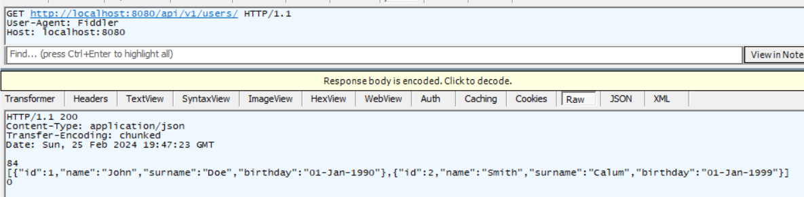
GET a user:
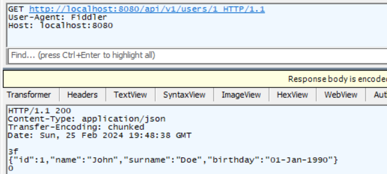
Create (POST) a user:
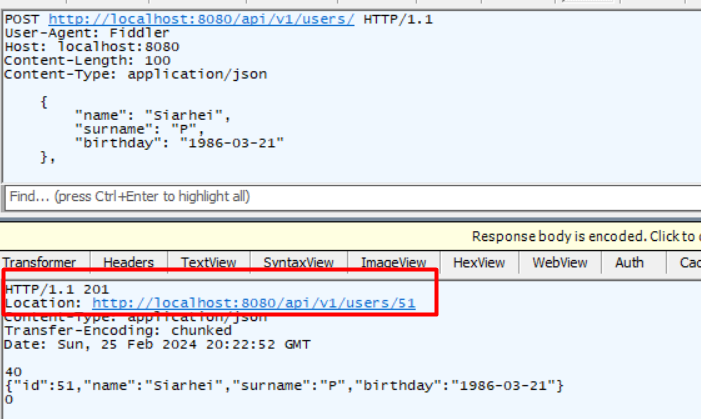
Update (PUT) the user:
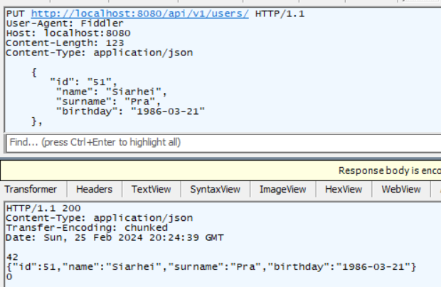
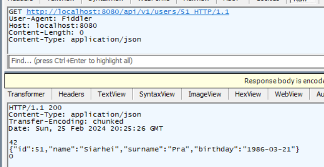
DELETE the user:
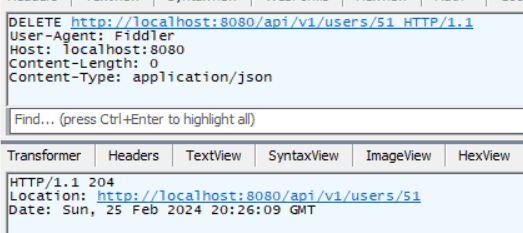
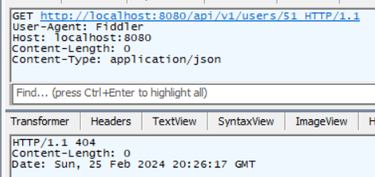

ServiceController:
GET
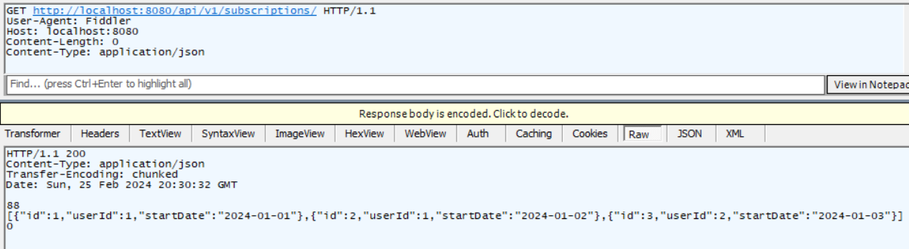
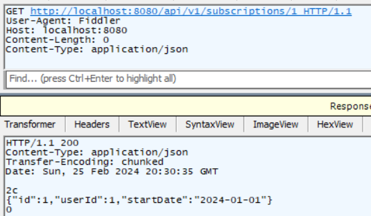
POST
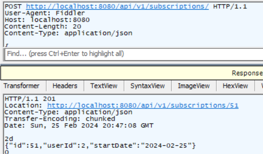
PUT
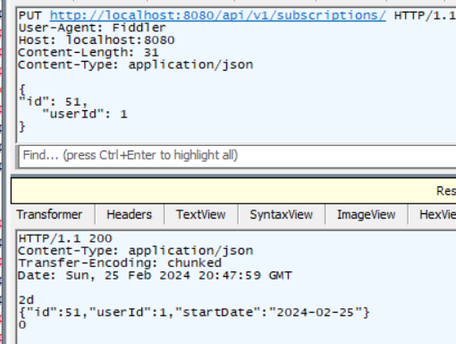
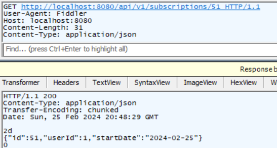
DELETE
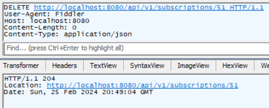
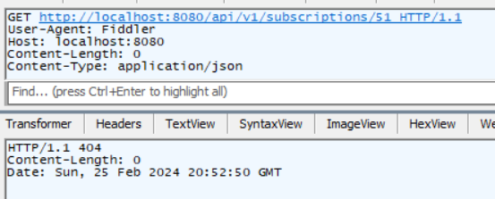

17. Use a DB to store the data (List, Map..).
18. Use spring boot data jpa module to access data.

I started with it in the first place

19. Use spring converters to convert :
- UserRequestDto to User - User to UserResponseDto - SubscriptionRequestDto to Subscription - Subscription to SubscriptionResponseDto

Done. In the module `jmp-cloud-service-impl`

20. Document methods in `UserController` and `ServiceController` using Swagger 2 annotations.
21. Make sample requests to `UserController` and `ServiceController` via Swagger UI, provide screenshots.

Updated only UserController::GET /users to save precious time
Before:
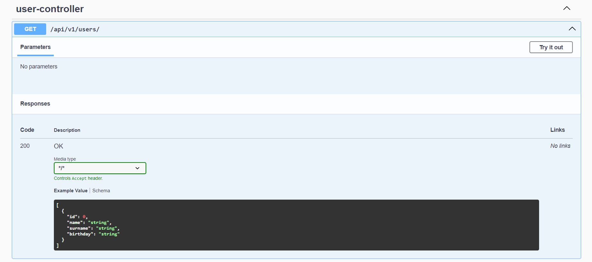
After:
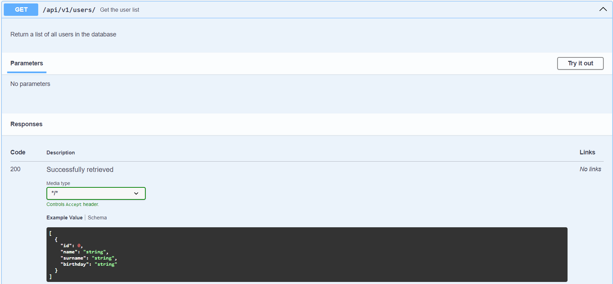
Request via Swagger UI (http://localhost:8080/swagger-ui/index.html):
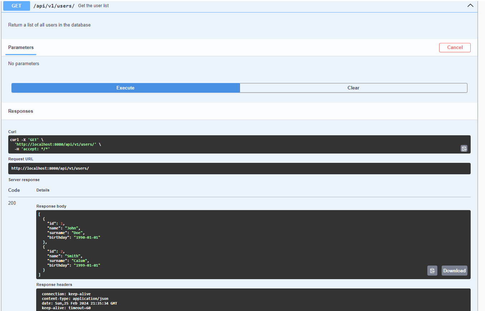

22. Use Java 9 modules wherever it’s applicable.

Done. Horrible experience.

23. Implement REST APIs according to all Richardson Maturity Level (0 - 3).
24. Make sample requests to `UserController` and `ServiceController`, provide screenshots/responses.

Just to demonstrate the concept, added only to UserController::getUser
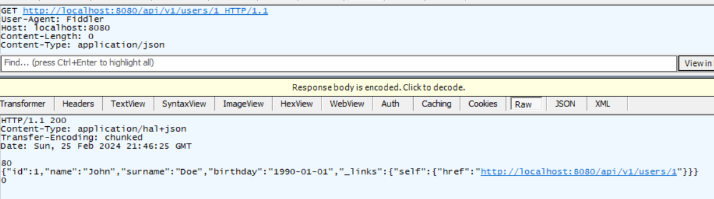
