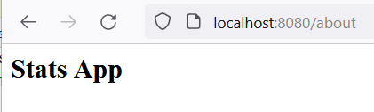
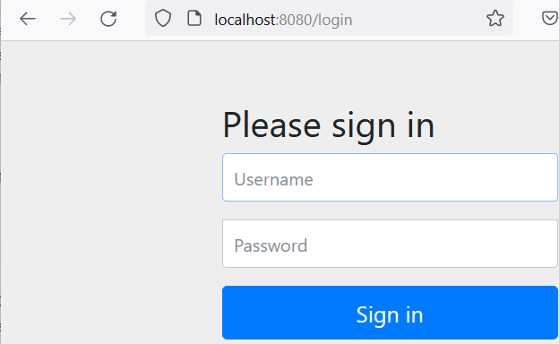
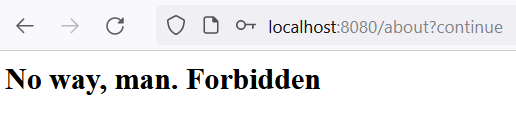
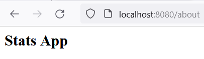
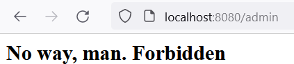
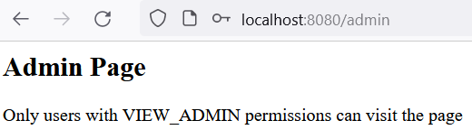
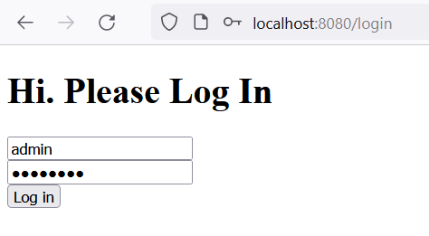
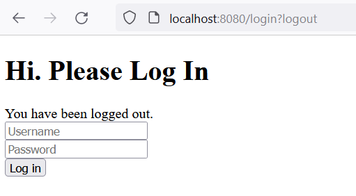
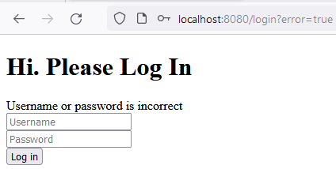
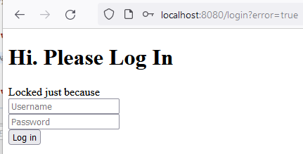

# Task 4.

1. Create Spring Boot MVC project.
Done. Created a new module `spring-security-basics`

2. Create REST endpoint "GET /info" that provide random stats (ex: "MVC application"). Test this endpoint.
Done. Created `InfoController` with the only `/info` endpoint. The only statistics it provides is `process.cpu.usage` taken from Actuator.
Results:

3. Add Spring Security module to your project and configure it for authenticated access to all resources. Use email/password combination for it.
   (2 starts)
Created `SecurityConfig` with a `SecurityFilterChain` set to authenticate any request `authorize(anyRequest, authenticated)`
Now: \
a. Start `http://localhost:8080/info` \
b. Redirect to login page:

Enter `user/password`
c. Expected results:

4. Use a non-embedded DB to store users.
Added `compose.yml` file with a basic Postgresql setup. \.
Configured datasource (in `application.yml`), set initialization scripts (`schema/data.sql`).\
Updated `SecurityConfig` to use `JdbcUserDetailsManager`.\
Before running the application, launch `docker compose up` (or `docker-compose up` for Podman)
The results are exactly the same as in 3.

5. Use salt and hashing to store user passwords. 
Did it from the start by using `DelegatingPasswordEncoder` and `bcrypt` password value. Bcrypt already assumes salt+hash techniques.

6. Create additional REST endpoint "GET /about" and configure non-authenticated access to it.
   (3-4 starts)
Created `AboutController`. PermitAll is set in Security filter chain for `/about` endpoint.

Any other page:

7. Create one more REST endpoint "GET /admin".
8. Now you need to add authorised access to "GET /info" and "GET /admin", add "VIEW_INFO", "VIEW_ADMIN" permissions for it. Create 3 users with different combination of permissions.\
Created `AdminController`.\
Set 3 users with password=`password`: \
user - no required permissions\
info - VIEW_INFO permission\
admin - VIEW_INFO, VIEW_ADMIN permissions\
Created a custom page for 403 response\
Login as user (both /about and /admin):\

Login as info:\

Login as admin:\

9. Create new Login/Logout pages and configure Spring Security to use new Login/Logout.
Created a single `login.html` which is displayed on both login and logout

Logout: http://localhost:8080/any_valid_path/logout

10. Add Brute Force protector. BLock user email for 5 minute on 3 unsuccessful login.
For better testing, set 1 minutes lock instead of 5.
Attempts 1..3:

Then:

After 60 seconds the cache is invalidated and we can start over.

11. Create an endpoint to show blocked users
    (5 start)
Implemented `/blocked-users` endpoing in `AdminController`

-----
12. Implement a new Spring Boot MVC application called "Secret providers". Application should provide page with text form. After sending a secret, application must generate uniq link address, to provide one-time access to secret information. After this information must be removed from application.
13. User (sender and recipient) must be authorized and have "STANDARD" permission.
14. Use docker containers to implement solution.
12-14 - NOT DONE.